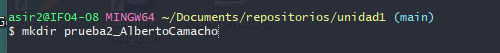
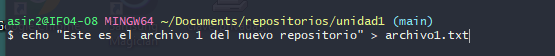
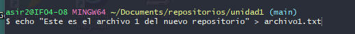
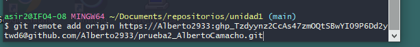
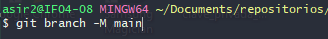
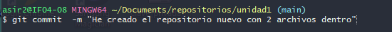
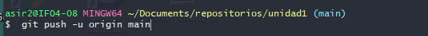
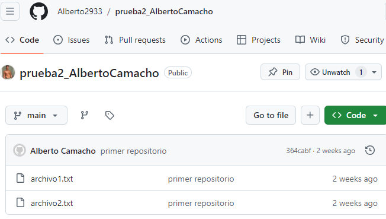

# EJERCICIO 1 ALBERTO CAMACHO 

Lo primero que haremos sera crear la carpeta en nuestro usuario local

--- 

ahora crearemos el archivo 1 y archivo 2

---

ahora vincularemos nuestra carpeta con el repositorio de github

---

ahora cambiaremos el nombre a la rama 

---

ahora comentaremos los cambios 

--- 
por ultimo subiremos los cambios 

--- 

veremos el resultado a continuacion 

