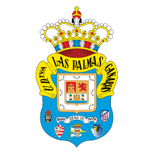

# inicio del ejercicio2 de Alberto Camacho

## Prueba del uso de subtitulos

texto con **palabras en negrita**, *palabras en cursiva* y `esto está escrito en codigo`

    hola buenas tardes esto es un trozo de codigo.

1. lista ordenada 1
2. lista ordenada 2
3. lista ordenada 3

- lista desordenada 1
- lista desordenada 2
- lista desordenada 3
  

https://lgarciavelazquez.github.io/iaw_202425/unidad1/taller2.html 

un enlace a un markdown de mi repositorio: https://github.com/Alberto2933/prueba_Alberto_Camacho/blob/main/ejercicio3.md 

una imagen cualquiera: 

|Columna 1 | columna 2 | columna 3 |
-----------|-----------|-----------|
|Linea 1 |Linea 1 |Linea 1 |
|Linea 2 |Linea 2 |Linea 2 |
|Linea 3 |Linea 3 |Linea 3 |