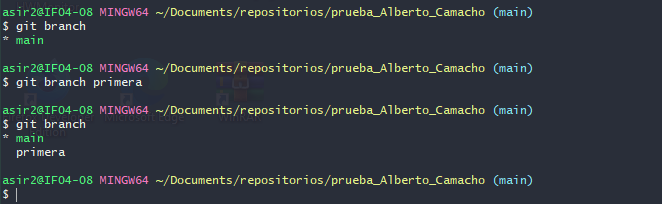
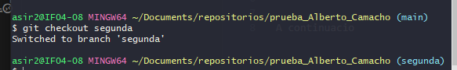
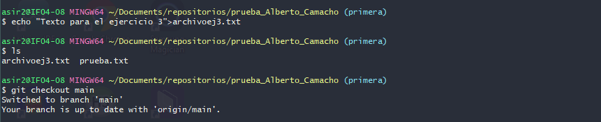
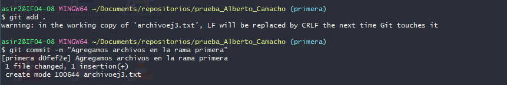
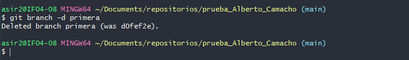
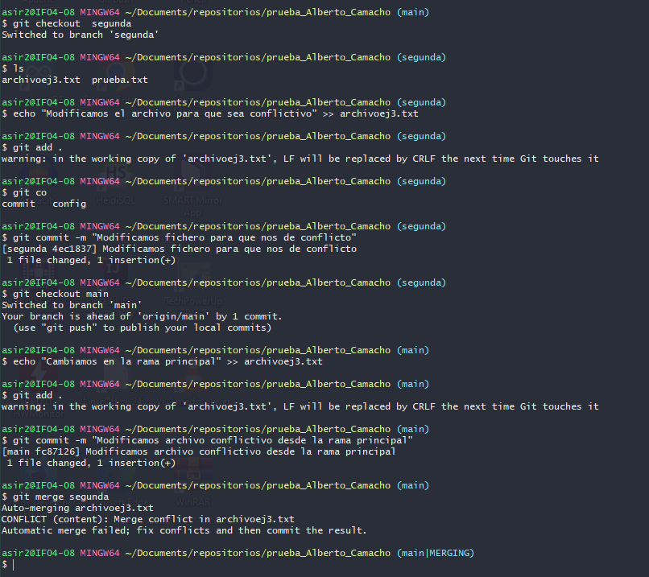
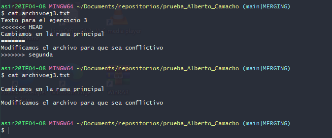
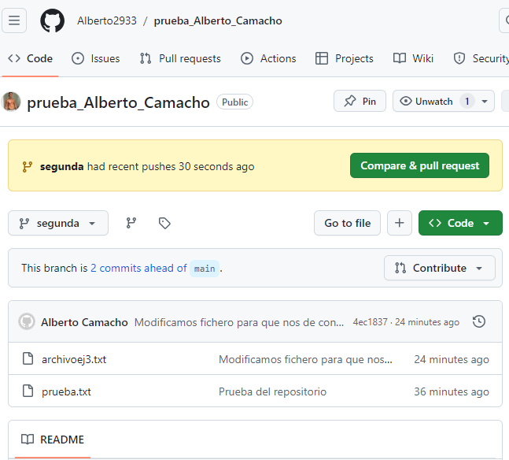

# EJERCICIO 3

Lo primero que haremos sera crear una nueva rama llamada "primera" y nos situaremos en ella, para ello usamos el siguiente comando

---

A continuacion crearemos un fichero que contenga texto

--- 

Despues de crear este fichero lo que haremos sera subir los cambios con git add y git commit 

---

volvemos a la rama main y clonamos lo hecho en la rama primera

este paso vemos que no nos ha dado error ya que no ha habido ningun conflicto entre ramas 

---

borramos la rama primera 

---

ahora volveremos a crear una rama llamada segunda y modificaremos el fichero creado antes desde las dos ramas que tenemos, primero desde main y despues desde segunda

en esta captura a la hora de clonar vemos que nos da error ya que hay informacion diferente en el mismo fichero proveniente de dos ramas diferentes 

---

aqui vemos que el fichero se nos ha cambiado y nos queda con los cambios de ambas ramas, en este caso lo he modificado de forma grafica y vemos el resultado abajo

---

una vez editado ya podremos hacer el git add y el git commit, una vez hecho esto haremos el push sobre la rama segunda para que se suba al repositorio en github

