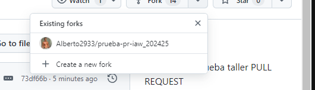
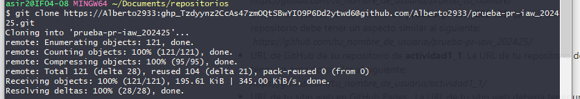
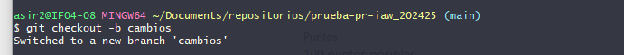
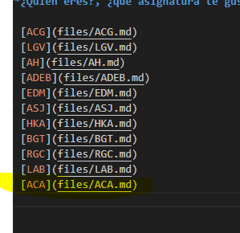
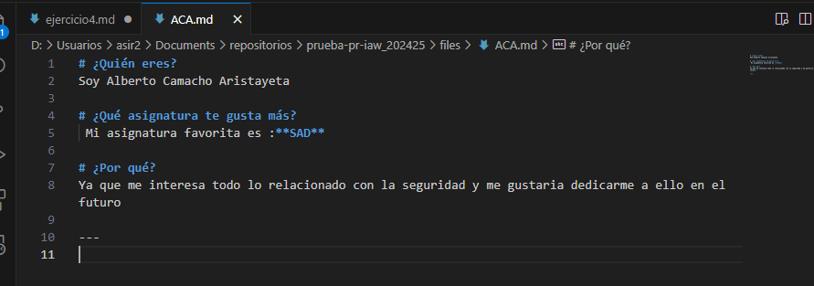
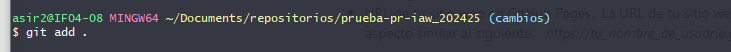
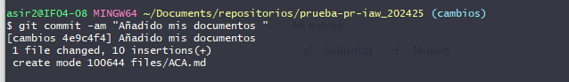
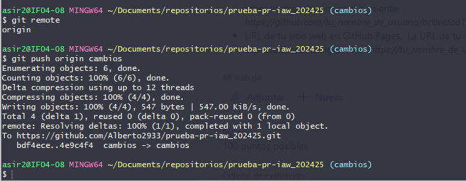

# EJERCICIO 4
--- 

Lo primero que haremos sera crear un fork 

--- 

despues de ello lo que haremos sera clonar el repositorio que nos ha creado 

---

una vez hecho esto lo que haremos sera cambiarnos de rama 

---

ahora añadiremos el documento que nos pide el ejercicio y un enlace 

---
cuando tenemos esto lo que haremos sera un "git add ." para subir los cambios y un git commit para cometar los cambios 

---

por ultimo haremos un git remote y un git push 

